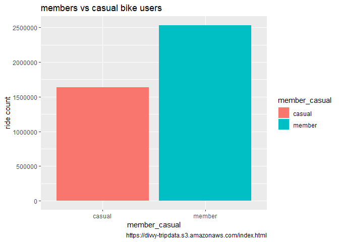
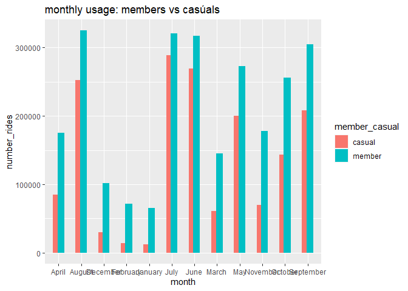
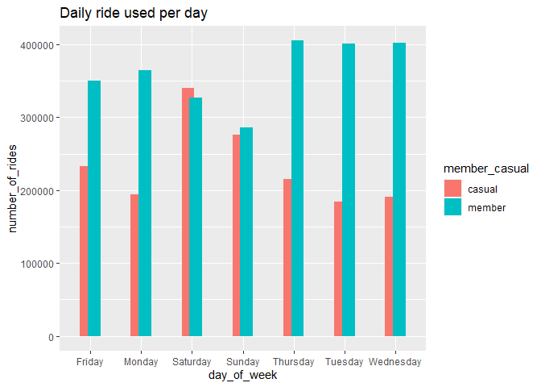
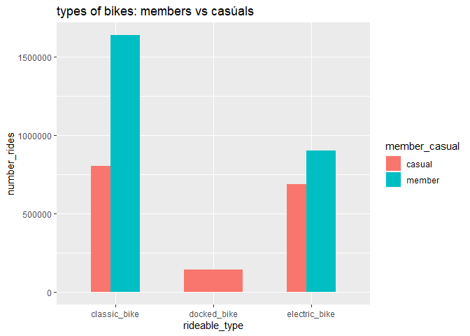
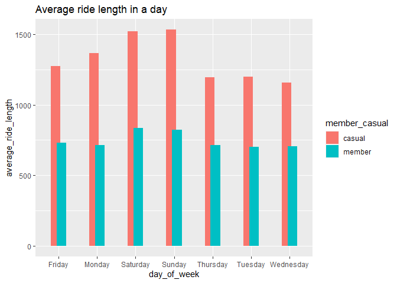
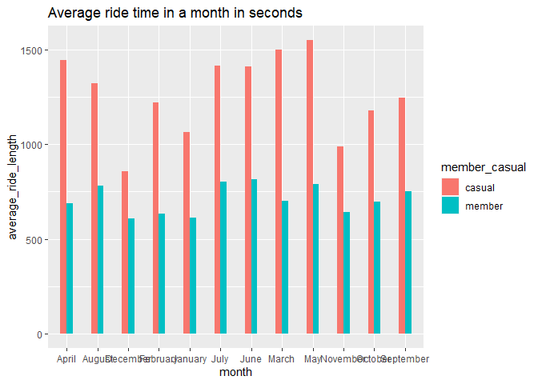

cyclistic bike share
================
Seth Gabienu
2023-07-06

## *Introduction*

this is a Google Data Analytics course project assignment organised by
Coursera and Google. the assignment or case study sought to explore
growth strategies of a fictitious Bike sharing company based in Chicago
named Cyclistic bike. the company is an app-based bike sharing firm and
has its market segmented into annual membership riders and casual
riders. the marketing team has been tasked to identify strategies that
would influence casual riders; riders who purchase a day ride pass or
single ride pass, to annual membership. as an analyst part of the
marketing analytic team, we’ve been tasked by our marketing director to
identify how bike usage between members and casual riders varies and
recommend base on our analysis how the casual riders to be converted to
annual members.

## *Background*

our exploration is into understanding how Cyclistic, a fictitious app
based bike sharing company based in Chicago, approaches its marketing
strategies and how recommendations can be made to enhance success of the
organisation by increasing memberships segment of the firm. Cyclistic
bike share, founded in 2016, as at 2020 had a little over 5800 bikes,
stationed in 692 locations in Chicago. the company has depended on the
concept of going green by creating awareness and appealing to the
general consumer segments. the firm has focused on flexible pricing
plans by segmenting the market into; single-ride passes, full-day
passes, annual memberships. the marketing team in simplifying the
segments, grouped them into; Cyclistic members for annual memberships
segment, casual riders for both riders that purchase single-ride pass
and full day pass.

the company has over the years of operation found out increasing their
annual memberships will go a long way to expand the financial fortunes
and has decided through the marketing department to identify strategies
and ways of inducing casual riders to becoming annual members. they also
want to know from our analysis, how digital media could also help their
marketing tactics. As part of the course requirements, we will be using
the Data Analytics phases of data analysis. they include; ask, prepare,
process, analyze, share, and act.

## *Ask*

Going by the data analytic phases in our lessons, we would first want to
ask some questions of interest related to the business task. we would
want to define the problem challenging our stakeholders (Cyclistic
marketing analytic team, marketing director, the executive team). this
will help make us focus on the project and avoid irrelevant issues. in
order to proceed to exploring our case study, we need to first
understand the situation of the organisation by asking some pertinent
questions pertaining to the bike usage offered by Cyclistic. this helps
define the problem at hand. finding the project outcome will require as
to ask the following question, a way to be sure of our understanding of
our case. 1. how are bikes usage between members and casual riders
different? this question would help us understand the significance of
the worthiness of the case study. 2. what will motivate casual riders to
become members? 3. how can Cyclistic use digital media to induce casual
riders to becoming members? although all questions are matters of
interest to our project, emphasis will be mainly on how members and
casual riders use bikes differently.

## *prepare*

This phase of our data analysis is concerned with the type of data
required to resolve our questions and how to organise it to make it
relevant for our business task. our dataset is a fictitious public data,
made available by Motivate International Inc and we downloaded it from
this link <https://divvy-tripdata.s3.amazonaws.com/index.html> The link
contains data on Cyclistic bike users from 2020 to 2023 but our interest
according to our case assignment is to focus on a 12 month period. in
doing this, we decide to focus on a 12 month calender year which is
January to Decenber 2022. Because of data privacy issues we are unable
to see riders previous purchases to their credit card information for
easy tracking. an examination of our data collected gives us a
structured and organised data where data elements are related to one
another and is also quantitative and wide in type. Since our dataset
contains the entire usage of bike for year 2022, data integrity relating
to sampling bias or observer bias do not exist. since our data is coming
from Motivate International Inc, we can verify the reliability,
originality comprehensiveness, current state, and can also be cited.
Also users were anonymized with ID numbers to obscure their identity.
The data is stored in a comma delimiter format (.csv). Because we will
be working in R studio, we will first load our packages.

### load packages

``` r
library(tidyverse)
library(dplyr)
library(janitor)
library(tidyr)
library(lubridate)
library(geosphere)
```

### importing datasets from local

``` r
library(readr)
jan<- read_csv("~/GDA/case study 1/2022/202201-divvy-tripdata.csv")
```

``` r
library(readr)
feb<- read_csv("~/GDA/case study 1/2022/202202-divvy-tripdata.csv")
```

``` r
library(readr)
mar<- read_csv("~/GDA/case study 1/2022/202203-divvy-tripdata.csv")
```

``` r
library(readr)
april<- read_csv("~/GDA/case study 1/2022/202204-divvy-tripdata.csv")
```

``` r
library(readr)
may<- read_csv("~/GDA/case study 1/2022/202205-divvy-tripdata.csv")
```

``` r
library(readr)
june<- read_csv("~/GDA/case study 1/2022/202206-divvy-tripdata.csv")
```

``` r
library(readr)
july<- read_csv("~/GDA/case study 1/2022/202207-divvy-tripdata.csv")
```

``` r
library(readr)
aug<- read_csv("~/GDA/case study 1/2022/202208-divvy-tripdata.csv")
```

``` r
library(readr)
sept<- read_csv("~/GDA/case study 1/2022/202209-divvy-publictripdata.csv")
```

``` r
library(readr)
oct<- read_csv("~/GDA/case study 1/2022/202210-divvy-tripdata.csv")
```

``` r
library(readr)
nov<- read_csv("~/GDA/case study 1/2022/202211-divvy-tripdata.csv")
```

``` r
library(readr)
dec<- read_csv("~/GDA/case study 1/2022/202212-divvy-tripdata.csv")
```

## *Process*

in this phase of our data analytics, we would want to examine the
integrity of our and tools we will be using for our analysis. It is
worthwhile noting that after we downloaded our dataset, we replicated
the dataset in an Excel format for future referencing. In this phase we
would want to highlight tools we would be using to manipulate and clean
our dataset. The following are tools employed for the studies. 1.
Microsoft Excel 2. R Studio 3. GitHub

The process phase involves making the dataset ready through cleaning
before it is transformed and analyzed. Since our data is stored in
monthly format, we would have to merge all the months for a
comprehensive analysis.

### combining all the data imported into a unified dataset

``` r
trip_22<-bind_rows(jan, feb, mar, april, may, june, july, aug, sept, oct, nov, dec)
```

### cleaning the dataset

We checked for outliers by using “str(trip_22)” for entire dataset.
Using the structure function provides a detailed informantion on the
dataset. We noticed incomplete entries appearing as “NA” . We therefore
had to filter the incomplete entries and we observed 1,298,426 entries
that had missing values in either a column or more than one columns.We
cleaned the dataset by dropping incomplete rows as captured in the photo
above. The order of the date format in our original dataset
(“started_at” and “ended_at”) is arranged as d/m/y_h:m and we need to
format it to in order to be recognized by R in this format y/m/d_h:m

### inspecting column names

After merging all the monthly datasets our dataset tallied 5, 667,717
rows. When we inspected the column names we noticed the following;
“ride_id”, “rideable_type”, “started_at”, “ended_at”,
“start_station_name”, “start_station_id”, “end_station_name”,
“end_station_id”, “start_lat”, “start_lng”, “end_lat”, “end_lng”,
“member_casual”, “ride_length” and “day_of_week” (Total of 15 columns).

``` r
head(trip_22)
```

    ## # A tibble: 6 × 15
    ##   ride_id          rideable_type started_at     ended_at ride_length day_of_week
    ##   <chr>            <chr>         <chr>          <chr>    <time>            <dbl>
    ## 1 98D355D9A9852BE9 classic_bike  01/01/2022 00… 01/01/2… 01'43"                7
    ## 2 04706CA7F5BD25EE electric_bike 01/01/2022 00… 01/01/2… 03'39"                7
    ## 3 42178E850B92597A electric_bike 01/01/2022 00… 01/01/2… 30'58"                7
    ## 4 6B93C46E8F5B114C classic_bike  01/01/2022 00… 01/01/2… 28'53"                7
    ## 5 466943353EAC8022 classic_bike  01/01/2022 00… 01/01/2… 28'29"                7
    ## 6 AC1F67BDCDDD5988 electric_bike 01/01/2022 00… 01/01/2… 00'26"                7
    ## # ℹ 9 more variables: start_station_name <chr>, start_station_id <chr>,
    ## #   end_station_name <chr>, end_station_id <chr>, start_lat <dbl>,
    ## #   start_lng <dbl>, end_lat <dbl>, end_lng <dbl>, member_casual <chr>

### checking for outliers

``` r
str(trip_22)
```

    ## spc_tbl_ [5,667,717 × 15] (S3: spec_tbl_df/tbl_df/tbl/data.frame)
    ##  $ ride_id           : chr [1:5667717] "98D355D9A9852BE9" "04706CA7F5BD25EE" "42178E850B92597A" "6B93C46E8F5B114C" ...
    ##  $ rideable_type     : chr [1:5667717] "classic_bike" "electric_bike" "electric_bike" "classic_bike" ...
    ##  $ started_at        : chr [1:5667717] "01/01/2022 00:00" "01/01/2022 00:01" "01/01/2022 00:01" "01/01/2022 00:02" ...
    ##  $ ended_at          : chr [1:5667717] "01/01/2022 00:01" "01/01/2022 00:04" "01/01/2022 00:32" "01/01/2022 00:31" ...
    ##  $ ride_length       : 'hms' num [1:5667717] 00:01:43 00:03:39 00:30:58 00:28:53 ...
    ##   ..- attr(*, "units")= chr "secs"
    ##  $ day_of_week       : num [1:5667717] 7 7 7 7 7 7 7 7 7 7 ...
    ##  $ start_station_name: chr [1:5667717] "Michigan Ave & 8th St" "Broadway & Waveland Ave" "Clark St & Ida B Wells Dr" "Michigan Ave & 8th St" ...
    ##  $ start_station_id  : chr [1:5667717] "623" "13325" "TA1305000009" "623" ...
    ##  $ end_station_name  : chr [1:5667717] "Michigan Ave & 8th St" "Broadway & Barry Ave" "Clark St & Ida B Wells Dr" "Michigan Ave & 8th St" ...
    ##  $ end_station_id    : chr [1:5667717] "623" "13137" "TA1305000009" "623" ...
    ##  $ start_lat         : num [1:5667717] 41.9 41.9 41.9 41.9 41.9 ...
    ##  $ start_lng         : num [1:5667717] -87.6 -87.6 -87.6 -87.6 -87.6 ...
    ##  $ end_lat           : num [1:5667717] 41.9 41.9 41.9 41.9 41.9 ...
    ##  $ end_lng           : num [1:5667717] -87.6 -87.6 -87.6 -87.6 -87.6 ...
    ##  $ member_casual     : chr [1:5667717] "casual" "casual" "casual" "casual" ...
    ##  - attr(*, "spec")=
    ##   .. cols(
    ##   ..   ride_id = col_character(),
    ##   ..   rideable_type = col_character(),
    ##   ..   started_at = col_character(),
    ##   ..   ended_at = col_character(),
    ##   ..   ride_length = col_time(format = ""),
    ##   ..   day_of_week = col_double(),
    ##   ..   start_station_name = col_character(),
    ##   ..   start_station_id = col_character(),
    ##   ..   end_station_name = col_character(),
    ##   ..   end_station_id = col_character(),
    ##   ..   start_lat = col_double(),
    ##   ..   start_lng = col_double(),
    ##   ..   end_lat = col_double(),
    ##   ..   end_lng = col_double(),
    ##   ..   member_casual = col_character()
    ##   .. )
    ##  - attr(*, "problems")=<externalptr>

### checking for distinct output

``` r
table(trip_22$rideable_type)  #total distinct values for ride types
```

    ## 
    ##  classic_bike   docked_bike electric_bike 
    ##       2601214        177474       2889029

``` r
table(trip_22$day_of_week)    # days of the week bikes used
```

    ## 
    ##      1      2      3      4      5      6      7 
    ## 776259 751014 782372 798223 841591 801787 916471

``` r
table(trip_22$member_casual)  #unique values for mebers and casual riders
```

    ## 
    ##  casual  member 
    ## 2322032 3345685

### dropping incomplete rows (NA) from our dataset

``` r
clean_trip_22<-subset(trip_22, complete.cases(trip_22))  #clean dataset
```

### formatting started_at and ended_at variables

``` r
clean_trip_22<-clean_trip_22 %>% mutate(started_at= format(dmy_hm(started_at)))%>% 
  mutate(ended_at= format(dmy_hm(ended_at)))  ##format started_at and ended_at date format 
```

### extract date, day of week, and month from started_at.

``` r
clean_trip_22$date_started<-strftime(clean_trip_22$started_at, format= "%y-%m-%d") ##extract date

clean_trip_22$month<-strftime(clean_trip_22$started_at, format= "%B")  ## extract month

clean_trip_22$day_of_week<-strftime(clean_trip_22$date_started, format= "%A")  ##extract day of the week
```

### adding unique ride distance in meters

``` r
clean_trip_22$ride_distance <- distGeo(matrix(c(clean_trip_22$start_lng, clean_trip_22$start_lat), ncol = 2), 
                                       matrix(c(clean_trip_22$end_lng, clean_trip_22$end_lat), ncol = 2)) ## ride distance in meters
```

### round ride_distance to 2 decimal points.

``` r
clean_trip_22$ride_distance<-round(clean_trip_22$ride_distance, digits= 2)
```

### further cleaning: droping trip distance that is \< 0

``` r
clean_trip_22 <- clean_trip_22[!(clean_trip_22$ride_distance <= 0),]
```

## *Analyze*

This phase of the project is more into the transformation of the dataset
to answer our assignment we have been tasked with. our project
assignment is to explore how annual membership subscription riders use
bike differently from casual riders. in this part, we would manipulate
the dataset dscriptively to understand the variance and what can be done
to achieve the objective of inducing casual riders to becoming annual
members.

### a quick summary of our dataframe

``` r
summary(clean_trip_22)
```

    ##    ride_id          rideable_type       started_at          ended_at        
    ##  Length:4168405     Length:4168405     Length:4168405     Length:4168405    
    ##  Class :character   Class :character   Class :character   Class :character  
    ##  Mode  :character   Mode  :character   Mode  :character   Mode  :character  
    ##                                                                             
    ##                                                                             
    ##                                                                             
    ##  ride_length       day_of_week        start_station_name start_station_id  
    ##  Length:4168405    Length:4168405     Length:4168405     Length:4168405    
    ##  Class1:hms        Class :character   Class :character   Class :character  
    ##  Class2:difftime   Mode  :character   Mode  :character   Mode  :character  
    ##  Mode  :numeric                                                            
    ##                                                                            
    ##                                                                            
    ##  end_station_name   end_station_id       start_lat       start_lng     
    ##  Length:4168405     Length:4168405     Min.   :41.65   Min.   :-87.83  
    ##  Class :character   Class :character   1st Qu.:41.88   1st Qu.:-87.66  
    ##  Mode  :character   Mode  :character   Median :41.90   Median :-87.64  
    ##                                        Mean   :41.90   Mean   :-87.64  
    ##                                        3rd Qu.:41.93   3rd Qu.:-87.63  
    ##                                        Max.   :45.64   Max.   :-73.80  
    ##     end_lat         end_lng       member_casual      date_started      
    ##  Min.   : 0.00   Min.   :-87.83   Length:4168405     Length:4168405    
    ##  1st Qu.:41.88   1st Qu.:-87.66   Class :character   Class :character  
    ##  Median :41.90   Median :-87.64   Mode  :character   Mode  :character  
    ##  Mean   :41.90   Mean   :-87.65                                        
    ##  3rd Qu.:41.93   3rd Qu.:-87.63                                        
    ##  Max.   :42.06   Max.   :  0.00                                        
    ##     month           ride_distance    
    ##  Length:4168405     Min.   :      0  
    ##  Class :character   1st Qu.:    979  
    ##  Mode  :character   Median :   1634  
    ##                     Mean   :   2208  
    ##                     3rd Qu.:   2819  
    ##                     Max.   :9817319

### examining the structure of the dataframe

``` r
str(clean_trip_22)
```

    ## tibble [4,168,405 × 18] (S3: tbl_df/tbl/data.frame)
    ##  $ ride_id           : chr [1:4168405] "04706CA7F5BD25EE" "42178E850B92597A" "AC1F67BDCDDD5988" "A5BD5A4FD53D5414" ...
    ##  $ rideable_type     : chr [1:4168405] "electric_bike" "electric_bike" "electric_bike" "electric_bike" ...
    ##  $ started_at        : chr [1:4168405] "2022-01-01 00:01:00" "2022-01-01 00:01:00" "2022-01-01 00:03:00" "2022-01-01 00:05:00" ...
    ##  $ ended_at          : chr [1:4168405] "2022-01-01 00:04:00" "2022-01-01 00:32:00" "2022-01-01 00:04:00" "2022-01-01 00:08:00" ...
    ##  $ ride_length       : 'hms' num [1:4168405] 00:03:39 00:30:58 00:00:26 00:02:07 ...
    ##   ..- attr(*, "units")= chr "secs"
    ##  $ day_of_week       : chr [1:4168405] "Saturday" "Saturday" "Saturday" "Saturday" ...
    ##  $ start_station_name: chr [1:4168405] "Broadway & Waveland Ave" "Clark St & Ida B Wells Dr" "Adler Planetarium" "Shields Ave & 31st St" ...
    ##  $ start_station_id  : chr [1:4168405] "13325" "TA1305000009" "13431" "KA1503000038" ...
    ##  $ end_station_name  : chr [1:4168405] "Broadway & Barry Ave" "Clark St & Ida B Wells Dr" "Adler Planetarium" "Emerald Ave & 31st St" ...
    ##  $ end_station_id    : chr [1:4168405] "13137" "TA1305000009" "13431" "TA1309000055" ...
    ##  $ start_lat         : num [1:4168405] 41.9 41.9 41.9 41.8 42 ...
    ##  $ start_lng         : num [1:4168405] -87.6 -87.6 -87.6 -87.6 -87.7 ...
    ##  $ end_lat           : num [1:4168405] 41.9 41.9 41.9 41.8 42 ...
    ##  $ end_lng           : num [1:4168405] -87.6 -87.6 -87.6 -87.6 -87.7 ...
    ##  $ member_casual     : chr [1:4168405] "casual" "casual" "member" "member" ...
    ##  $ date_started      : chr [1:4168405] "22-01-01" "22-01-01" "22-01-01" "22-01-01" ...
    ##  $ month             : chr [1:4168405] "January" "January" "January" "January" ...
    ##  $ ride_distance     : num [1:4168405] 1330.56 50.6 7.02 815.59 1703.7 ...

### examining the average ride_length for the dataset

``` r
clean_trip_22 %>%  
  summarise(avg_ride_length = mean(ride_length), median_length = median(ride_length), 
            max_ride_length = max(ride_length), min_ride_length = min(ride_length)) 
```

    ## # A tibble: 1 × 4
    ##   avg_ride_length median_length max_ride_length min_ride_length
    ##   <drtn>          <time>        <drtn>          <drtn>         
    ## 1 978.765 secs    10'32"        86362 secs      0 secs

### checking the unique average ride length for both members and casual riders exclusively

``` r
clean_trip_22 %>% group_by(member_casual) %>% 
  summarise(average_ride_length = mean(ride_length), median_length = median(ride_length), 
            max_ride_length = max(ride_length), min_ride_length = min(ride_length))
```

    ## # A tibble: 2 × 5
    ##   member_casual average_ride_length median_length max_ride_length
    ##   <chr>         <drtn>              <time>        <drtn>         
    ## 1 casual        1347.7417 secs      13'38"        86362 secs     
    ## 2 member         740.7689 secs      09'00"        86180 secs     
    ## # ℹ 1 more variable: min_ride_length <drtn>

### Average ride length by months

``` r
clean_trip_22 %>% group_by(member_casual, month) %>% 
  summarise(average_month_ride_length = mean(ride_length), median_month_length = median(ride_length), 
            max_month_ride_length = max(ride_length), min_month_ride_length = min(ride_length),.groups = "drop")
```

    ## # A tibble: 24 × 6
    ##    member_casual month    average_month_ride_length median_month_length
    ##    <chr>         <chr>    <drtn>                    <time>             
    ##  1 casual        April    1444.4157 secs            14'25"             
    ##  2 casual        August   1323.9080 secs            13'35"             
    ##  3 casual        December  856.2905 secs            08'37"             
    ##  4 casual        February 1222.8356 secs            10'53"             
    ##  5 casual        January  1063.2873 secs            09'56"             
    ##  6 casual        July     1416.8827 secs            14'38"             
    ##  7 casual        June     1413.0781 secs            14'47"             
    ##  8 casual        March    1500.7481 secs            14'37"             
    ##  9 casual        May      1550.1390 secs            15'48"             
    ## 10 casual        November  987.8537 secs            09'53"             
    ## # ℹ 14 more rows
    ## # ℹ 2 more variables: max_month_ride_length <drtn>,
    ## #   min_month_ride_length <drtn>

### average daily ride length

``` r
clean_trip_22 %>% group_by(member_casual, day_of_week) %>% 
  summarise(average_day_ride_length = mean(ride_length), median_day_length = median(ride_length),max_day_ride_length = max(ride_length), min_day_ride_length=min(ride_length),.groups ="drop") %>% 
  arrange(member_casual, day_of_week)
```

    ## # A tibble: 14 × 6
    ##    member_casual day_of_week average_day_ride_length median_day_length
    ##    <chr>         <chr>       <drtn>                  <time>           
    ##  1 casual        Friday      1273.1607 secs          13'05"           
    ##  2 casual        Monday      1367.8927 secs          13'26"           
    ##  3 casual        Saturday    1520.5405 secs          15'48"           
    ##  4 casual        Sunday      1531.5724 secs          15'46"           
    ##  5 casual        Thursday    1196.2552 secs          12'12"           
    ##  6 casual        Tuesday     1200.3070 secs          11'58"           
    ##  7 casual        Wednesday   1157.2637 secs          11'53"           
    ##  8 member        Friday       728.7328 secs          08'51"           
    ##  9 member        Monday       712.1707 secs          08'35"           
    ## 10 member        Saturday     836.4423 secs          10'06"           
    ## 11 member        Sunday       823.6279 secs          09'50"           
    ## 12 member        Thursday     715.5672 secs          08'48"           
    ## 13 member        Tuesday      701.0759 secs          08'37"           
    ## 14 member        Wednesday    705.3324 secs          08'44"           
    ## # ℹ 2 more variables: max_day_ride_length <drtn>, min_day_ride_length <drtn>

### analyzing the average distance for the dataset

``` r
clean_trip_22 %>% group_by(member_casual) %>% 
  summarise(average_ride_distance = mean(ride_distance), median_distance = median(ride_distance), 
            max_ride_distance = max(ride_distance), min_ride_distance = min(ride_distance))
```

    ## # A tibble: 2 × 5
    ##   member_casual average_ride_distance median_distance max_ride_distance
    ##   <chr>                         <dbl>           <dbl>             <dbl>
    ## 1 casual                        2325.           1770.          9817319.
    ## 2 member                        2132.           1544.          9816617.
    ## # ℹ 1 more variable: min_ride_distance <dbl>

### average monthly distance covered by members and casual riders

``` r
clean_trip_22 %>% group_by(member_casual, month) %>% 
  summarise(average_month_ride_distance = mean(ride_distance), median_month_distance = median(ride_distance),max_month_ride_distance = max(ride_distance), min_month_ride_distance=min(ride_distance),.groups ="drop") %>% 
  arrange(member_casual, month)
```

    ## # A tibble: 24 × 6
    ##    member_casual month    average_month_ride_distance median_month_distance
    ##    <chr>         <chr>                          <dbl>                 <dbl>
    ##  1 casual        April                          2352.                 1802.
    ##  2 casual        August                         2334.                 1795.
    ##  3 casual        December                       1796.                 1401.
    ##  4 casual        February                       2036.                 1569.
    ##  5 casual        January                        1961.                 1470.
    ##  6 casual        July                           2365.                 1827.
    ##  7 casual        June                           2387.                 1867.
    ##  8 casual        March                          2326.                 1768.
    ##  9 casual        May                            2428.                 1871.
    ## 10 casual        November                       2273.                 1530.
    ## # ℹ 14 more rows
    ## # ℹ 2 more variables: max_month_ride_distance <dbl>,
    ## #   min_month_ride_distance <dbl>

### average daily ride distance

``` r
clean_trip_22 %>% group_by(member_casual, day_of_week) %>% 
  summarise(average_day_ride_distance = mean(ride_distance), median_day_distance = median(ride_distance),max_day_ride_distance = max(ride_distance), min_day_ride_distance=min(ride_distance),.groups ="drop") %>% 
  arrange(member_casual, day_of_week)
```

    ## # A tibble: 14 × 6
    ##    member_casual day_of_week average_day_ride_distance median_day_distance
    ##    <chr>         <chr>                           <dbl>               <dbl>
    ##  1 casual        Friday                          2266.               1733.
    ##  2 casual        Monday                          2244.               1699.
    ##  3 casual        Saturday                        2456.               1890.
    ##  4 casual        Sunday                          2410.               1852.
    ##  5 casual        Thursday                        2249.               1726.
    ##  6 casual        Tuesday                         2214.               1694.
    ##  7 casual        Wednesday                       2315.               1707.
    ##  8 member        Friday                          2066.               1514.
    ##  9 member        Monday                          2063.               1494.
    ## 10 member        Saturday                        2219.               1654.
    ## 11 member        Sunday                          2183.               1622.
    ## 12 member        Thursday                        2098.               1529.
    ## 13 member        Tuesday                         2076.               1509.
    ## 14 member        Wednesday                       2237.               1527.
    ## # ℹ 2 more variables: max_day_ride_distance <dbl>, min_day_ride_distance <dbl>

### counting type of bike used

``` r
clean_trip_22 %>% 
  group_by(member_casual, rideable_type) %>% 
  summarise(number_rides=n(),.groups = "drop")
```

    ## # A tibble: 5 × 3
    ##   member_casual rideable_type number_rides
    ##   <chr>         <chr>                <int>
    ## 1 casual        classic_bike        804145
    ## 2 casual        docked_bike         143454
    ## 3 casual        electric_bike       686847
    ## 4 member        classic_bike       1635370
    ## 5 member        electric_bike       898589

as can be seen, classic bikes were more used by members compared to
casual riders. members did not use docked bikes, which is unlike casual
riders

### checking count of members and casual bike riders.

``` r
clean_trip_22%>% 
  group_by(member_casual) %>% 
  summarise(ride_count = length(ride_id), ride_percentage = (length(ride_id) / nrow(clean_trip_22)) * 100) 
```

    ## # A tibble: 2 × 3
    ##   member_casual ride_count ride_percentage
    ##   <chr>              <int>           <dbl>
    ## 1 casual           1634446            39.2
    ## 2 member           2533959            60.8

## *Share*

this phase is concerned with presenting a graphical analysis to
stakeholders involved in the project.

### plottting count of bike users

we want to check the number of bike usage between members and casual
riders. the graphics below shows that members patronised the bikes more
than casual riders

``` r
ggplot(data = clean_trip_22)+
  geom_bar(mapping = aes(x=member_casual,fill=member_casual))+
  labs(title = "members vs casual bike users", caption = "https://divvy-tripdata.s3.amazonaws.com/index.html", x= "member_casual", y="ride count")
```

<!-- -->

it can be seen from the chart that annual members tend to use bikes 20%
more than casual riders

### plotting monthly ride distribution

this plot shows a breakdown into months of number of bike usage between
members and casual riders.

``` r
clean_trip_22 %>% 
  group_by(member_casual, month) %>% 
  summarise(number_rides =n(),  average_ride_month=mean(ride_length),.groups = "drop") %>% 
  arrange(month, member_casual) %>% 
  ggplot(aes(x=month, y=number_rides, fill=member_casual))+
  labs(title = "monthly usage: members vs casúals")+
  geom_col(width = 0.6, position = position_dodge(width = 0.4))+
  scale_y_continuous(labels = function(x) format(x, scientific=FALSE))
```

<!-- -->

an examination of the monthly distribution of bike usage shows that
annual members usage of bike was very high during June, July, August,
which can partly be explained by the summer period. we also noticed
similarly, casual riders also recorded high usage during the same period
but unlike annual members.

### plotting daily usage of bikes by members and casual riders

``` r
clean_trip_22 %>% 
  group_by(member_casual, day_of_week) %>%  #groups by member_casual
  summarise(number_of_rides = n() #calculates the number of rides and average duration 
            ,average_ride_length = mean(ride_length),.groups="drop") %>% 
  arrange(day_of_week,member_casual) %>%
    ggplot(aes(x = day_of_week, y = number_of_rides, fill = member_casual)) +
  labs(title ="Daily ride used per day") +
  geom_col(width=0.5, position = position_dodge(width=0.3)) +
  scale_y_continuous(labels = function(x) format(x, scientific = FALSE))
```

<!-- -->

the daily usage presenting an interesting dynamics. we observed that,
casual riders tend to use the bike more than annual members on
Saturdays.

### plotting type of bikes used

we want to check the different types of bike used by members and casual
riders

``` r
clean_trip_22 %>% 
  group_by(member_casual, rideable_type) %>% 
  summarise(number_rides =n(),.groups = "drop") %>% 
  arrange(rideable_type, member_casual) %>% 
  ggplot(aes(x=rideable_type, y=number_rides, fill=member_casual))+
  labs(title = "types of bikes: members vs casúals")+
  geom_col(width = 0.6, position = position_dodge(width = 0.4))+
  scale_y_continuous(labels = function(x) format(x, scientific=FALSE))
```

<!-- -->

we discovered that while both riders used both classic bikes and
electric bikes, casual riders also used docked bikes.

### Average ride length per day in seconds

``` r
clean_trip_22 %>%  
  group_by(member_casual, day_of_week) %>% 
  summarise(average_ride_length = mean(ride_length), .groups="drop") %>%
  ggplot(aes(x = day_of_week, y = average_ride_length, fill = member_casual)) +
  geom_col(width=0.5, position = position_dodge(width=0.3)) + 
  labs(title ="Average ride length in a day")
```

<!-- -->

we noticed that casual riders throughout the week spent more time on
average biking than annual members, with weekends being their busiest
periods

### plotting average time for bike usage in a month

``` r
clean_trip_22 %>%  
  group_by(member_casual, month) %>% 
  summarise(average_ride_length = mean(ride_length), .groups="drop") %>%
  ggplot(aes(x = month, y = average_ride_length, fill = member_casual)) +
  geom_col(width=0.4, position = position_dodge(width=0.4)) + 
  labs(title ="Average ride time in a month in seconds")
```

<!-- -->

on monthly, casual riders spent more time riding especially in March,
April, and May 2022, compared to annual members who mainly spent about
half usage time of casual riders

## *Act*

so far, our analysis’ captured in the plots gives an interesting
picture. first, we discovered that the average annual usage time of the
bikes for causal riders was about twice the usage time for annual
members with 1348 seconds and 741 seconds respectively. this shows that
annual members spent less time riding unlike casual riders. on monthly
basis, casual riders spent a lot time riding in March, April, and May
and weekend tend to be periods casual riders spent a lot of time biking.
Also, it is evident that the average annual distance covered by casual
riders was 2.2% higher than annual members, with both averaging 2324.723
meters and 2132.218 meters respectively. However, bike usage between
both casual riders and annual members showed a 39.21% and 60.79%
accordingly. this explains that annual members usage of bikes was more
than 20% higher than casual riders. we observed that bike usage was high
during the summer periods for both riders but the distribution was
higher for annual members through the month. we found out that casual
riders had a high demand for bikes on weekend unlike annual members with
spike in demand during the weekdays. Finaly, it emerged that annual
members had high preference for classic bikes with no interest in docked
bikes.

While the data provides mixed and unique findings, we observed that the
uniqueness of ride id to a ride makes it difficult to track a casual
rider’s usage of bike for a period. as a result would have help explore
the frequency an individual rider uses the bike on weekly or monthly
basis. this we believe would have help narrow the casual riders to
target. Thus, having knowledge about how each casual rider uses bike and
providing weekly or monthly reports via the app about bike usage would
segment and target casual riders who have high demand for the service.
we also suggest monthly subscriptions for users who may not need the
service for the entire year due to weather changes and other factors but
may demand the bikes for about a week or more.
